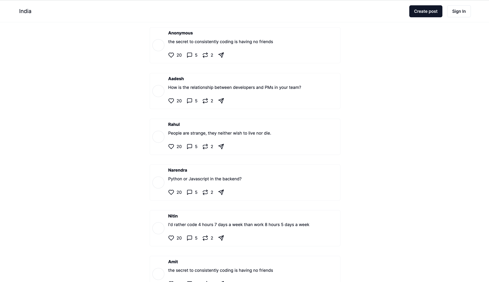
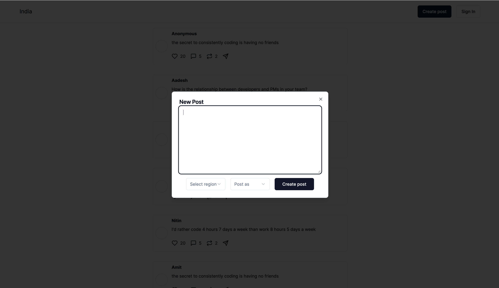

### App

India.figuringout.life - Let's fix India's problems, one step at a time. 
Indian Population ~ 1,400,000,000. We are 1/5th of the World's population. One of the biggest reasons for India's slow Growth is the size of our population (allegedly!). 

I don't think the population is the reason, rather, the inability of the population to collaborate together and solve the problems. This app is an attempt to discover all the pain points within India. 
The first step towards change is acceptance. Accepting that there is a problem, clearly defining it, prioritzing it and resolving it. 
While it is not possible for you or me alone to do all of this by themself. That's why, the app acts as an aggregator platform.

You discover a problem, you post it on the app.
Other users who strongly feel the same, can lift the problem upwards by liking it. The more people like the problem, the higher is it's priority.
Someone from News channel / Government / public figure / Businessmen reads these problems and might put enough resources to solve it. 

May be, it will work. May be, it won't. If we never try, we would never know. 


### Setup:

- Git clone
- cp .env.sample .env
- Add all configuration values: 
```bash
MONGODB_URI=""
GOOGLE_CLIENT_ID=""
GOOGLE_CLIENT_SECRET=""
NEXTAUTH_URL="http://localhost:3000"
NEXTAUTH_SECRET="password_nextauth"
```
- npm install
- npm run dev

### Tech:
NextJs + Shadcn + MongoDb (Mongoose as ORM)

### Base features
- SignIn using Google
- Create a post
- See all posts
- Like a post (Pending)
- Comment on a post (Pending)


### Screenshots:

##### Home Screen


##### New Post Screen

